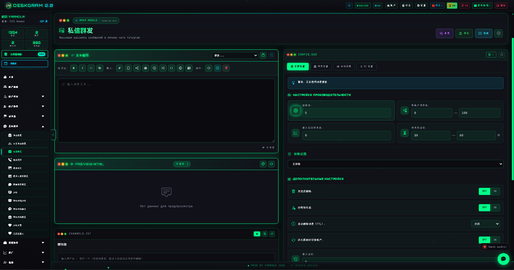
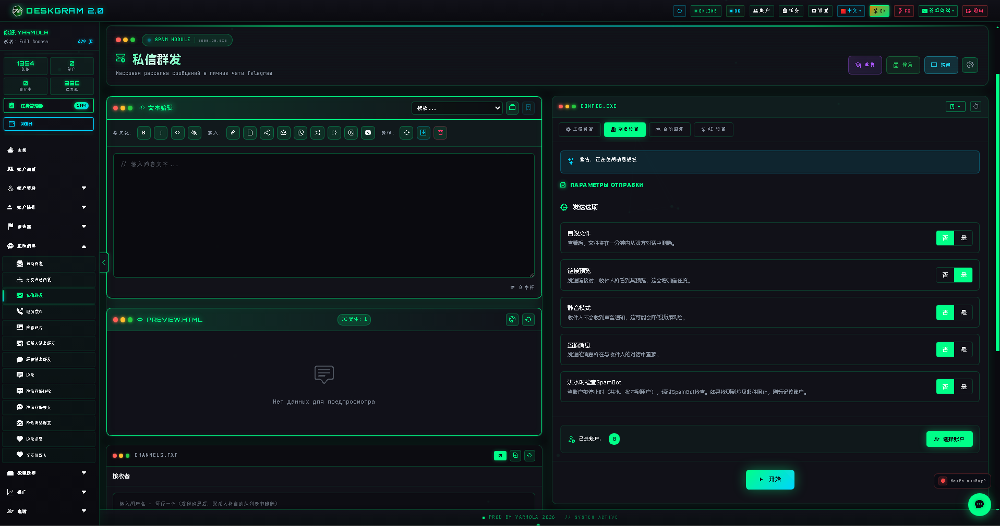
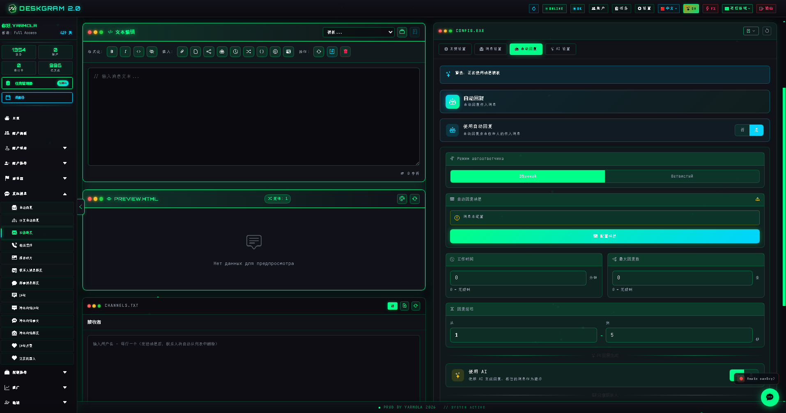
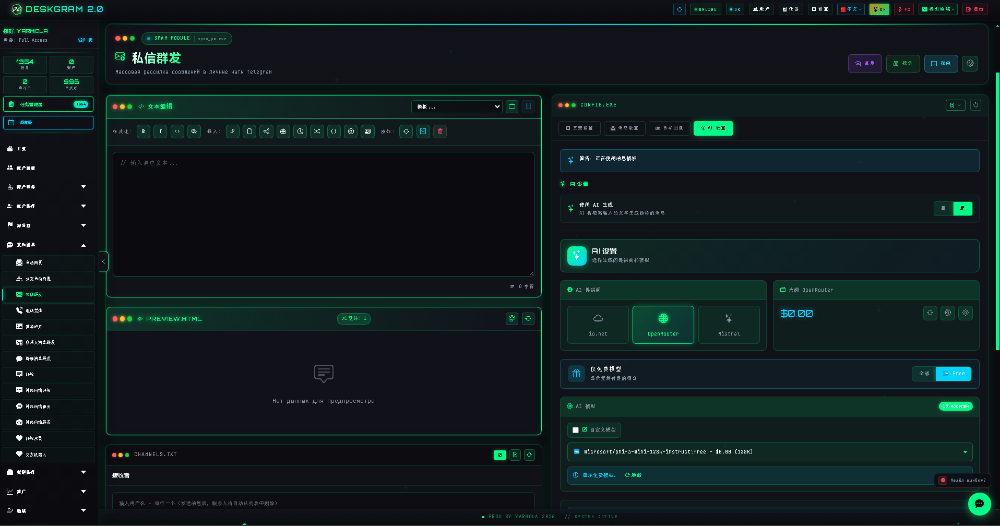

# Deskgram 2 私信群发

私信群发是 Deskgram 2 中用于 Telegram 私聊触达的模块。它把消息构建、发送控制、限额、延迟、自动回复、AI 改写和执行管理整合到同一个界面中。

[Deskgram 2 中文总览](https://github.com/Deskgram-2/deskgram-2-telegram-automation-zh) | [官网](https://deskgram2.com/) | [Telegram Bot](https://t.me/DG2welcomebot) | [Web Preview](https://deskgram2.com/web-preview)

## 模块简介

| 参数 | 内容 |
|---|---|
| 核心任务 | 向 Telegram 私聊批量发送消息 |
| 内容支持 | 文本、媒体、转发、故事和构造器模式 |
| 扩展层 | 自动回复、计划发送、AI 改写与生成 |
| 适用场景 | 获客、预热、后续沟通、批量触达 |
| 关联模块 | 受众收集、批量订阅 |

## 模块能力

- 向 Telegram 私聊批量发送消息；
- 基于预先准备的接收者列表执行；
- 配置线程、限额和延迟；
- 使用 AI 生成或改写文案；
- 在首次发送后接入自动回复逻辑；
- 记录日志和统计结果；
- 处理排除规则和黑名单。

## 快速开始

1. 准备接收者列表。
2. 在消息构造器中生成消息内容。
3. 配置线程、限额和延迟。
4. 需要时启用 AI 或自动回复。
5. 分配账号并启动流程。

## 这个流程适合连接哪些模块

- [受众收集](https://github.com/Deskgram-2/telegram-audience-parser-deskgram-zh)，如果接收者基础还没有准备好。
- [账号面板](https://github.com/Deskgram-2/telegram-account-manager-deskgram-zh)，如果需要先整理账号网格。
- [代理管理](https://github.com/Deskgram-2/telegram-proxy-manager-deskgram-zh)，如果触达依赖稳定的代理基础设施。
- [设置](https://github.com/Deskgram-2/telegram-automation-settings-deskgram-zh)，如果会使用 AI 和共享系统参数。
- [批量订阅](https://github.com/Deskgram-2/telegram-join-groups-deskgram-zh)，如果发送前要先把账号带入目标环境。

## 界面亮点

### 主界面

### 发送选项

### 自动回复

### AI 设置

## 适合在什么情况下使用

- 当你需要从已整理好的受众基础执行 Telegram 触达；
- 当首次发送后仍然需要跟进逻辑；
- 当重复发送时文案变化非常重要；
- 当你希望清晰看到节奏、状态和日志。

## 相比手动私聊更方便的地方

| 手动方式 | Deskgram 2 私信群发 |
|---|---|
| 发送速度慢而重复 | 工作流支持多线程 |
| 限额难以管理 | 限额和延迟可提前配置 |
| 缺少统一的活动视图 | 日志和统计内置 |
| 跟进回复容易遗漏 | 自动回复可以继续流程 |
| 文案容易重复 | AI 帮助改写和变化内容 |

## 相关仓库

- [Deskgram 2 中文总览](https://github.com/Deskgram-2/deskgram-2-telegram-automation-zh)
- [受众收集](https://github.com/Deskgram-2/telegram-audience-parser-deskgram-zh)
- [批量订阅](https://github.com/Deskgram-2/telegram-join-groups-deskgram-zh)
- [账号面板](https://github.com/Deskgram-2/telegram-account-manager-deskgram-zh)
- [代理管理](https://github.com/Deskgram-2/telegram-proxy-manager-deskgram-zh)
- [设置](https://github.com/Deskgram-2/telegram-automation-settings-deskgram-zh)

## FAQ

### 不用 AI 可以吗？

可以。AI 是可选层，不是强制依赖。

### 可以处理后续回复吗？

可以。自动回复就是私信群发之后很自然的下一步。
